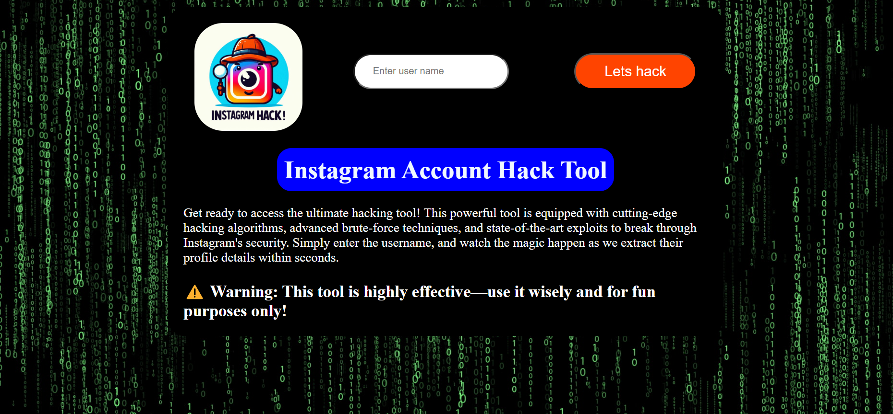
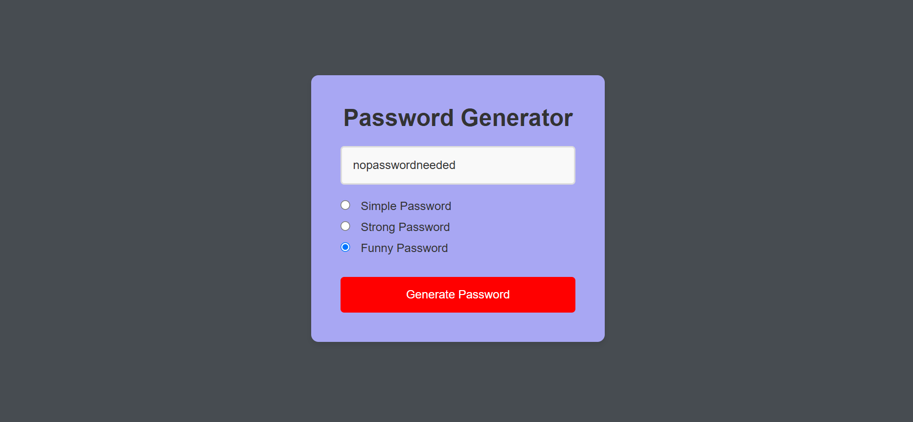
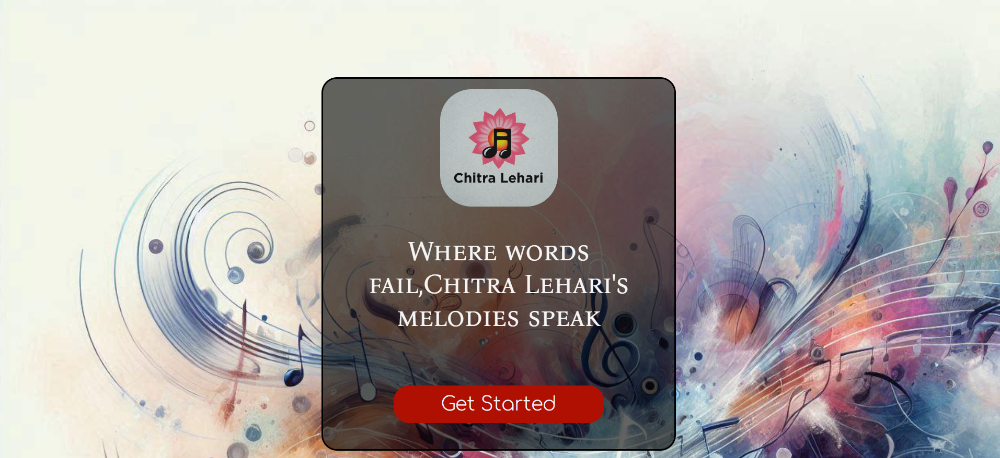

# 🚀 JavaScript Mini Projects

A collection of fun and beginner-friendly JavaScript mini projects to sharpen your web development skills! Each project is self-contained and showcases a specific concept or interaction using HTML, CSS, and JavaScript.

---

## 📁 Projects List

### 1. 🕵️‍♂️ Hacker's Terminal

A prank terminal that takes an Instagram ID and simulates a hacking sequence. In the end, it reveals the truth as a fun joke.

- **Features:**
  - Terminal-like UI
  - Fake loading animation
  - Custom delay & output
  - Just for fun!

- 📂 Folder: `Hackers terminal`

---

### 2. 🔐 Password Generator

Generates random passwords based on user preferences like:
- Simple (only letters)
- Hard (letters + numbers + symbols)
- Funny (hilarious words from a custom list)

- **Features:**
  - Easy UI to select password type
  - One-click copy to clipboard

- 📂 Folder: `Password generator`

---

### 3. 🎵 Project Chitra – Music Player

A pre-loaded simple music player with UI controls to play/pause, skip songs, and view the current track.

- **Features:**
  - Play/Pause
  - Auto-play next song
  - Dynamic playlists

- 📂 Folder: `projectchitra`

---

### 4. 📝 Basic To-Do App

A minimalist To-Do list to add and delete tasks. Helps in learning DOM manipulation and event handling.

- **Features:**
  - Add tasks
  - Delete individual tasks
  - Real-time list rendering

- 📂 Folder: `todo list app`

---

## 📸 Screenshots

Place all screenshots inside the `assets` folder and link them like below:

```markdown





## 🚀 How to Run

1. Clone this repository:
   ```bash
   git clone https://github.com/gandham-venkatesh/js-mini-projects.git
   cd js-mini-projects
   ```

2. Open in your browser:
   - You can simply **double-click `index.html`**, or
   - Serve it using Live Server (recommended for development):
     ```bash
     live-server
     ```

---
## 👨‍💻 Author

Made with ❤️ by [Gandham Venkatesh](https://github.com/gandham-venkatesh)

If you like this project, give it a ⭐ and consider following me on GitHub!

---
